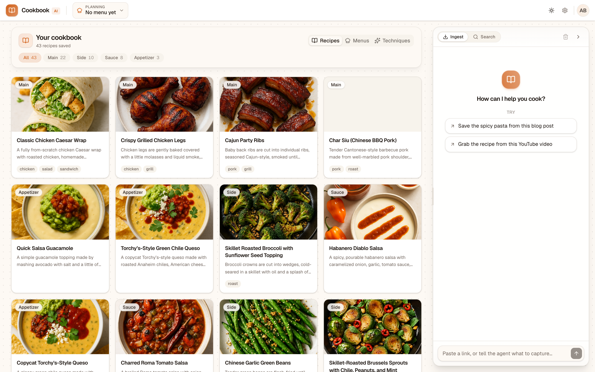
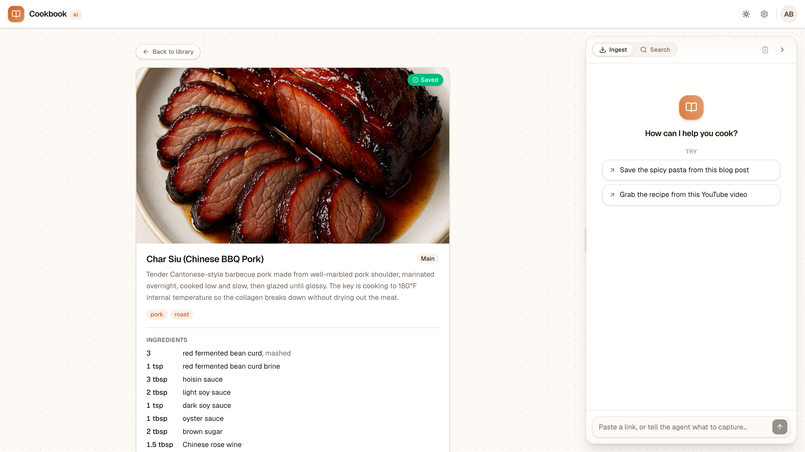
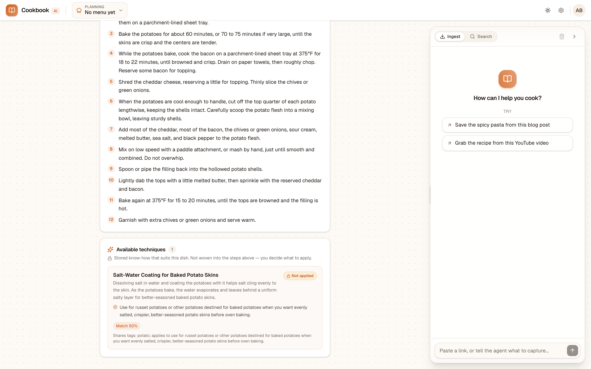
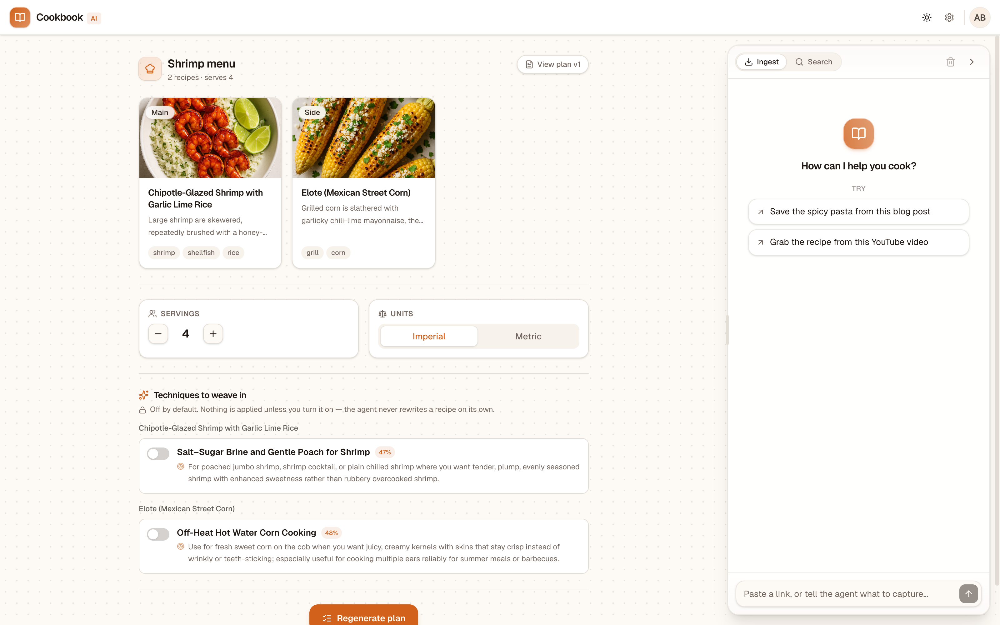
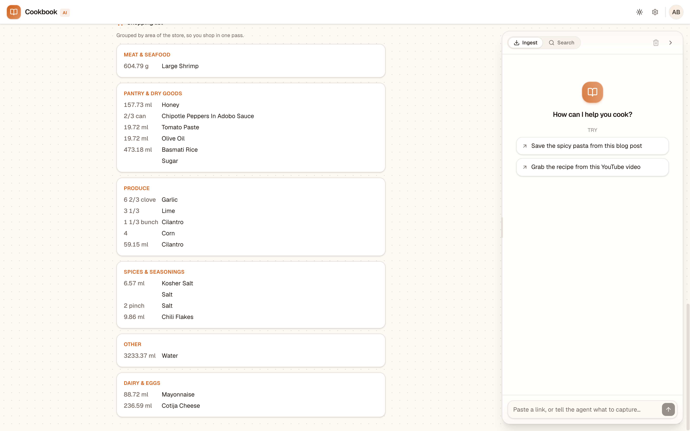

<div align="center">


# Cookbook AI

**A conversational agent that captures recipes and cooking techniques from the messy places they actually live, builds a knowledge layer that compounds as you add to it, and helps you plan and shop without taking the thinking away from you.**

Built as an interview assignment for the DataRobot Professional Services team.

[**Live demo →**](https://recipe-agent-demo.vercel.app)

</div>

---



## The problem

I cook a lot, and the recipes I want live in places that are hostile to actually cooking from them. A great recipe is buried in a 12 minute YouTube video or behind a wall of blog narrative and ads. When I find a technique worth reusing, like a salt and baking soda brine for shrimp, that knowledge evaporates because it lives in one video I'll never find again.

When I plan a real meal I have to reconcile servings by hand, convert units, brainstorm a side that pairs well, and write a shopping list that I then re sort in my head by where things sit in the store. None of these tools learn. Every recipe starts from zero, and nothing I save makes the next meal easier to plan.

I wanted a tool that **augments me as the chef instead of cooking for me**. It captures from the sources I already use, gets smarter the more I feed it, and keeps me in control of every decision that matters.

## The solution

One chat box and a live artifact panel. You paste a blog URL or a YouTube link with a plain language instruction like *"save the second recipe, the spicy pasta, ignore the first"* and the agent figures out what you meant, extracts a clean structured recipe that streams into the panel as it's built, and saves it. The library ships seeded with 43 real recipes so it feels alive from the first second.

You can also ingest a **technique**, and the agent automatically associates it with every applicable recipe in your library, in both directions, so the order you save things in never matters. When you plan a meal you create a menu, ask the agent to find a complementary side **from your own saved sides**, and generate a final plan. The plan scales to your serving count, converts units with deterministic math, weaves in only the techniques you choose, and hands you a shopping list grouped by aisle.

## See it work

| Structured extraction | Bidirectional association |
|---|---|
|  |  |
| A messy blog or video becomes normalized ingredients, steps, controlled tags, a summary, and a generated cover photo. | A saved technique surfaces on every recipe it fits, with a match score and the reason, marked **not yet applied**. |

| You decide what gets applied | Deterministic shopping list |
|---|---|
|  |  |
| Techniques are off by default. The agent never rewrites a recipe on its own. You pick which ones to weave in, and it flags conflicts. | Quantities consolidate across recipes and scale to your serving count using real math, then group by area of the store. |

## Architecture

A single agent owns the whole conversation. It's built on the Vercel AI SDK `ToolLoopAgent` and runs on one streaming chat endpoint. The agent classifies intent from the URL plus your message (recipe or technique, which subset to save) and branches from there. Two soft modes, **ingest** and **search**, bias the system prompt without ever locking you out of a tool.

The core design principle is **route to deterministic tools wherever accuracy is non negotiable, and use the model only where judgment and prose genuinely help**.

```
                 ┌──────────────────────────────────────────────┐
   You ────────▶ │  RecipeAgent (ToolLoopAgent, one chat route)  │
   (chat + link) │  classifies intent · picks tools · streams    │
                 └───────────────┬──────────────────────────────┘
                                 │ calls tools
        ┌────────────────────────┼────────────────────────────────┐
        ▼                        ▼                                 ▼
  Deterministic tools      LLM tools                         Read tools
  (the trust layer)        (judgment + prose)                (over Convex)
  • UnitConverter          • RecipeExtractor                 • find / get recipe
  • IngredientConsolidator • TechniqueExtractor              • get menu
  • AssociationEngine      • SideDishMatcher (ranking)       • techniques for recipe
    (tag filter +          • PlanBuilder (technique
     vector rank)            incorporation + aisle grouping)
                                 │
                                 ▼
                  Convex (schema · queries/mutations ·
                  vector index · file storage for images)
```

### The tools the agent can call

`fetch_and_extract` · `save_recipe` · `fetch_and_extract_technique` · `save_technique` · `search_recipes` · `find_recipes` · `get_recipe` · `create_menu` · `add_recipe_to_menu` · `set_menu_servings` · `get_menu` · `list_menus` · `generate_side_dishes` · `build_menu_plan`

### Why these choices

- **`UnitConverter` is pure math, never the LLM.** Same dimension only, so volume to volume and weight to weight. It refuses to fake a volume to weight conversion because that needs per ingredient density. This is the correctness critical trust module, and it's the on stage proof of a guardrail.
- **`IngredientConsolidator` is pure math too.** It merges identical ingredients across recipes and scales to a target serving count, so the shopping list is always right.
- **`AssociationEngine` runs bidirectionally.** A controlled tag filter narrows candidates, then vector similarity ranks them with a score you can see. A new technique scans existing recipes, and a new recipe scans existing techniques, so ingest order doesn't matter.
- **Technique incorporation is never automatic.** The human picks which associated techniques get woven into a plan, and the agent flags when two choices conflict. Augment, not override.
- **Sides come from your own library, not generation.** That's what makes the knowledge layer demonstrably compound in value.
- **Failures surface conversationally.** A bad link, a missing transcript, no recipe found, or an empty search all come back as plain language, never a stack trace. Image generation runs after save and never blocks ingestion.

### Source fetching

Blog URLs are fetched and cleaned readability style. YouTube transcripts use an environment selected provider. Local seeding uses a free direct scrape path on a residential IP, and live ingestion on Vercel uses the Supadata managed API, because Vercel's datacenter IPs are blocked by YouTube. Same interface, swapped implementation per environment.

## Tech stack

| Layer | Choice |
|---|---|
| Framework | Next.js 16 (App Router) |
| UI | React 19, Tailwind, shadcn/ui, partial object streaming into the artifact panel |
| Agent | Vercel AI SDK v7 `ToolLoopAgent` |
| Model | `gpt-5.4-mini` for text, `text-embedding-3-small` for vectors, `gpt-image-1` for covers. The provider lives in one file (`src/lib/model.ts`), so swapping it is a one line change. |
| Data | Convex (reactive queries, a vector index for semantic search, file storage for cover images) |
| Hosting | Vercel |
| Tests | Vitest over the pure logic modules |

## Running it locally

```bash
npm install
cp .env.example .env.local      # fill in the keys below
npx convex dev                  # links Convex + writes the CONVEX_* vars
npm run dev                     # http://localhost:3000
```

Environment variables (see `.env.example`):

- `OPENAI_API_KEY` for all text, embedding, and image calls
- `NEXT_PUBLIC_CONVEX_URL` and `NEXT_PUBLIC_CONVEX_SITE_URL`, written by `npx convex dev`
- `SUPADATA_API_KEY` for YouTube transcripts when deployed (local seeding uses a free path)

Other commands:

```bash
npm test          # run the unit tests (UnitConverter, IngredientConsolidator, AssociationEngine, TagVocabulary)
npm run seed      # run the real ingestion pipeline locally to populate the library
```

The seed runs the actual ingestion pipeline against real sources, so the seeded library carries real tags, embeddings, cover images, and a few pre associated techniques. The data is real, not mocked.

## How this maps to enterprise agentic AI

This is a consumer app, but it's intentionally isomorphic to the agentic problems DataRobot customers face.

- **Ingest unstructured sources, emit structured entities.** Swap recipes and techniques for support tickets, contracts, or clinical notes and the shape is identical.
- **Route to deterministic tools where accuracy is non negotiable.** The unit converter is a stand in for any place a business cannot tolerate an LLM guess, like pricing, dosing, or compliance math. The model orchestrates, the deterministic code computes.
- **A knowledge layer that compounds.** Bidirectional association means every new entity makes the existing corpus more valuable, which is the whole promise of an enterprise knowledge graph that learns.
- **A human in the loop by design.** Nothing irreversible happens without an explicit human choice, and conflicts get surfaced rather than silently resolved. That's the governance story enterprises actually need.

The productionization path is straightforward. Add authentication and multi tenancy, swap the single user Convex store for a governed data layer, put the model behind a gateway with observability and fallback, and extend discovery beyond the user's own library. The agent architecture doesn't change.
